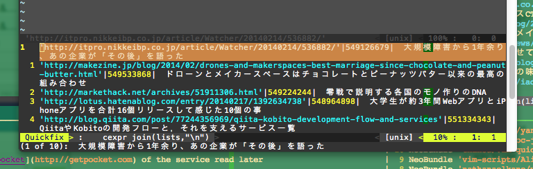

pocket.vim
===

This Plugin to manipulate the [pocket](http://getpocket.com) of the service read later

Vim as an application platform.

Install
---

use [webapi-vim](https://github.com/mattn/webapi-vim)

```vim:.vimrc
NeoBundle 'mattn/webapi-vim'
NeoBundle 'soramugi/pocket.vim'
```

    :NeoBundleInstall

How to use
---

    :PocketList

It's important to get you are prompted for a `consumer_key` or `access_token`

<https://getpocket.com/developer/apps/>



Let's access in the browser url that is displayed

We recommend you to access the browser using this [open-browser.vim](https://github.com/tyru/open-browser.vim) plugin

List of current line `favorite` or `archive`

    :PocketFavorite
    :PocketArchive
